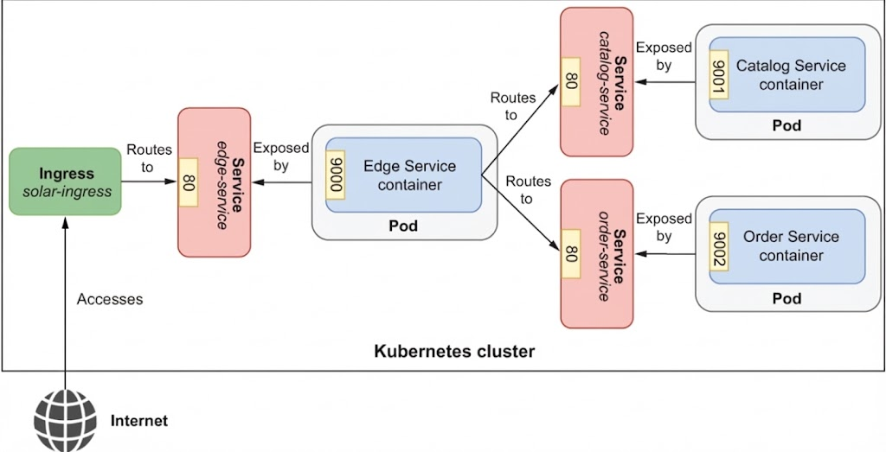

# Edge Service

This provides an API gateway and a ingress point in the Solar Bookshop system.
An API gateway is a common pattern in distributed architectures that acts as a single entry point for clients to 
interact with multiple backend services. It handles requests by routing them to the appropriate service, 
aggregating responses, and performing various cross-cutting concerns such as security, monitoring, and resilience.

Edge Service improves recilience of the system by configuring circuit breakers with 
[Spring Cloud Circuit Breaker](https://spring.io/projects/spring-cloud-circuitbreaker),
defining rate limiters with [Spring Data Redis](https://spring.io/projects/spring-data-redis) Reactive, 
and using retries and timeouts with Spring WebFlux. It also stores web session state using 
[Spring Session](https://spring.io/projects/spring-session) Data Redis, a NoSQL in-memory data store.



## Useful Commands

| Gradle Command             | Description                                   |
|:---------------------------|:----------------------------------------------|
| `./gradlew bootRun`        | Run the application.                          |
| `./gradlew build`          | Build the application.                        |
| `./gradlew test`           | Run tests.                                    |
| `./gradlew bootJar`        | Package the application as a JAR.             |
| `./gradlew bootBuildImage` | Package the application as a container image. |

After building the application, you can also run it from the Java CLI:

```bash
java -jar build/libs/edge-service-0.0.1-SNAPSHOT.jar
```
