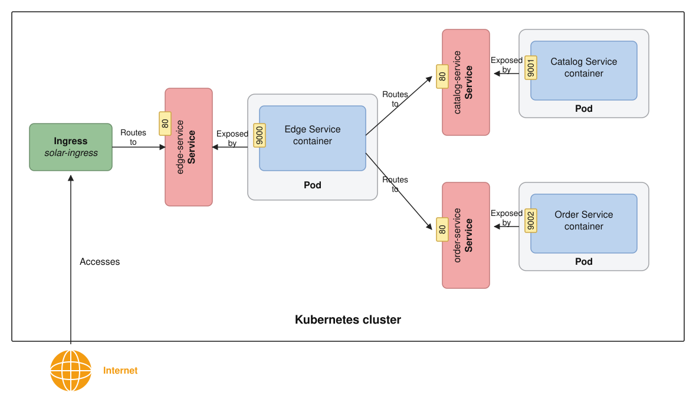
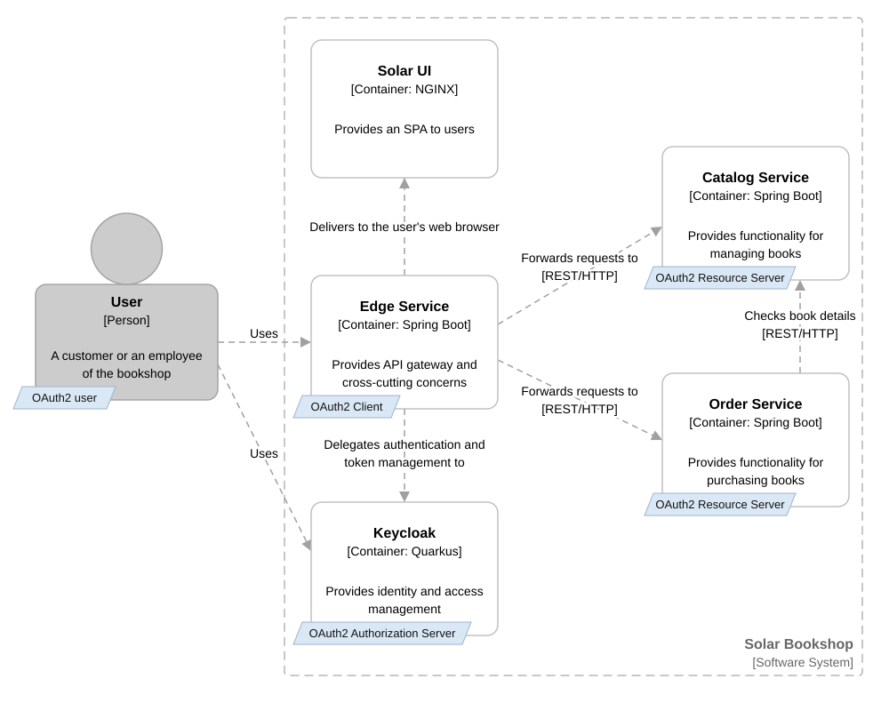

# Edge Service

This provides an API gateway and a ingress point in the Solar Bookshop system.
An API gateway is a common pattern in distributed architectures that acts as a single entry point for clients to 
interact with multiple backend services. It handles requests by routing them to the appropriate service, 
aggregating responses, and performing various cross-cutting concerns such as security, monitoring, and resilience.

Edge Service improves resilience of the system by configuring circuit breakers with 
[Spring Cloud Circuit Breaker](https://spring.io/projects/spring-cloud-circuitbreaker),
defining rate limiters with [Spring Data Redis](https://spring.io/projects/spring-data-redis) Reactive, 
and using retries and timeouts with Spring WebFlux. It also stores web session state using 
[Spring Session](https://spring.io/projects/spring-session) Data Redis, a NoSQL in-memory data store.



Access control systems allow users access to resources only when their identity has been proven and they have the required permissions.

### Authentication
Authentication is the process of proving that you are who you say you are. This is achieved by verification of the identity of a person or device. It's sometimes shortened to Authorization
Authorization is the act of granting an authenticated party permission to do something. It specifies what data you're allowed to access and what you can do with that data. Authorization is sometimes shortened to AuthZ. AuthN.

### Authorization
Authorization is the act of granting an authenticated party permission to do something. It specifies what data you're allowed to access and what you can do with that data. Authorization is sometimes shortened to AuthZ.

### Feature of edge-service
- Authenticaton using a dedicated identity and access management solution, **Keycloak**. Makes use of **Spring Security** to secure applications and adopt standards like **JWT**, **OpenID Connect**, and **OAuth 2.0**.
- Role based access control strategy (RBAC) is used to protect the REST endpoints exposed by Spring Boot, depending upon if the user is a *customer* or an *employee* of the bookshop.
- It configures data auditing to keep tack of which user and what changes.
- Enforces protection rules for data so that only its owner can access it.


>How the OIDC/OAuth2 roles are assigned to the entities in the Solar Bookshop architecture

## Useful Commands

| Gradle Command             | Description                                   |
|:---------------------------|:----------------------------------------------|
| `./gradlew bootRun`        | Run the application.                          |
| `./gradlew build`          | Build the application.                        |
| `./gradlew test`           | Run tests.                                    |
| `./gradlew bootJar`        | Package the application as a JAR.             |
| `./gradlew bootBuildImage` | Package the application as a container image. |

After building the application, you can also run it from the Java CLI:

```bash
java -jar build/libs/edge-service-0.0.1-SNAPSHOT.jar
```
